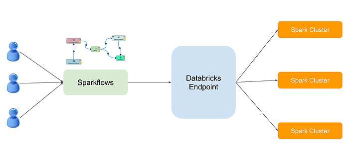
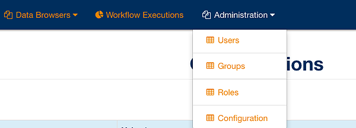

Run your Fire Workflows on Databricks
-------------------------------------------

**Fire is integrated with Databricks. Below are the key integration points:**

  * Fire can be configured to talk with the Databricks endpoint.
  * Datasets can be created in Fire pointing to your tables in Databricks.
  * Workflows can be created in Fire with these datasets.
  * Workflows from Fire are run on the Databricks cluster.
  * As the workflow is running, the summary results from the nodes are streamed back to Fire and displayed.

**Note:** In order to create certain results from Fire, and be able to use it in your Databricks Notebooks, create a temp table from the result with RegisterTempTable Node in Fire.

Enable Databricks in Fire
-------------------------------

In Administration/Configuration tab within the Fire UI,

  * Set databricks.enabled to true.
  * Set the app.postMessageURL to point to the public IP/hostname of the machine on which Fire is installed. Results from the Fire jobs running in Databricks is streamed back to this URL.

Configure the Databricks Endpoint in Fire
----------------------------------------------------

In Databricks/Configuration, configure the Databricks Endpoint. The Databricks username, password and endpoint are needed to set up the endpoint.
For security reasons, nothing gets saved, and just stays in memory only. So when logging back in, the endpoint configuration has to be done again.

.. figure:: ../../_assets/administration/databricks-configuration.png
   :scale: 100%
   :alt: Fire Databricks Configuration
   :align: center

Create a library on Databricks with fire jar
-----------------------------------------------

The workflows from Fire are powered by the code in the fire jar file contained in the directory sparkflows-x.y.z/fire-lib

Upload the fire jar file with dependencies to Databricks as a New Library : fire-core-x.y.z-jar-with-dependencies.jar. Use the Library Link in Databricks to create a new library and upload the fire core jar file. The jar file is ~155 MB.

.. figure:: ../../_assets/administration/welcome-databricks.png
   :scale: 100%
   :alt: Fire Welcome Databricks
   :align: center

Create a table on Databricks or use an existing table you have created on Databricks
-------------------------------------------------------------------------------------

.. figure:: ../../_assets/administration/create-table.png
   :scale: 100%
   :alt: Fire Create Table
   :align: center
